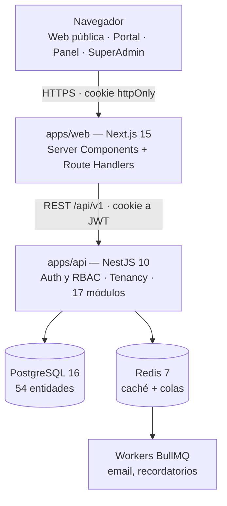

# Beauty Suite

SaaS multi-tenant de marca blanca para centros de belleza: agenda, CRM, caja,
inventario, comisiones, fidelización, academia y portal público de reservas.
Construido y puesto en producción por una sola persona.

| | |
|---|---|
| **API** · NestJS 10 | 19.006 líneas · 232 ficheros · 17 módulos de dominio |
| **Web** · Next.js 15 | 29.215 líneas · 260 ficheros · 6 superficies |
| **Datos** · PostgreSQL 16 | 54 entidades en Prisma, con migraciones |
| **Tests** | 18 suites de servicio |
| **Infra** | Docker multi-etapa, Redis con BullMQ, CI en GitHub Actions |

Cada salón es un *tenant* aislado que personaliza marca, dominio y datos por
configuración. Un mismo despliegue sirve a todos.

---

## Arquitectura



**Multi-tenancy**: base y esquema compartidos, con columna `tenantId` en toda
entidad de negocio. `PrismaService` fuerza el filtro por tenant en cada consulta,
de modo que olvidarlo no es posible desde el código de dominio. El tenant se
resuelve por cabecera en desarrollo, y por subdominio o dominio propio en
producción.

Detalle completo en [`docs/SPEC.md`](docs/SPEC.md), 262 líneas de especificación.

---

## Decisiones de ingeniería

Lo que distingue a este proyecto no es el stack, es cómo resuelve los problemas
que aparecen cuando el software tiene un cliente real que lo usa a diario.

**El seed se ejecuta en cada despliegue y no puede destruir nada.**
El servicio de migración corre `prisma migrate deploy && seed` en cada subida,
sobre una base que el salón edita todos los días desde su panel. Por eso el seed
solo **crea lo que falta**: jamás sobrescribe precios, textos, fotos, marca,
contraseñas, sellos de fidelización ni opiniones. El contenido de ejemplo se
siembra únicamente al arrancar un tenant vacío. Existe un `SEED_FORCE_UPDATE=1`
para restaurar valores canónicos, y está documentado que no debe tocar producción.

**El despliegue solo sube lo que está versionado.**
`scripts/deploy.sh` sincroniza a partir de `git ls-files`, así que nunca viajan
capturas, ficheros temporales ni sobras del escritorio. Lo que deja de estar
versionado se borra del servidor mediante un manifiesto. El `.env` de producción
vive solo en el VPS y el script aborta si detecta uno versionado.

**Copia de seguridad antes de cada migración, sin excepción.**
Con rotación de las diez últimas. Si el volcado sale vacío, aborta sin migrar:
más vale no desplegar que migrar sin red.

**Verificación después de desplegar.**
Espera a que los contenedores estén sanos y comprueba por HTTP que la portada y
el login responden 200. Si no, falla ruidosamente en vez de dejar el sitio caído
en silencio.

**Configuración validada al arrancar.**
Las variables de entorno se validan con zod en el arranque de la API. Si falta
una, el proceso no levanta. Nada de descubrir a las tres semanas que una clave
estaba vacía.

---

## Cómo levantar

Requisitos: Docker y Docker Compose. Para desarrollo local, Node 22 y pnpm 10.

```bash
make setup     # crea .env desde .env.example
make up        # postgres, redis, mailhog, api y web
make migrate && make seed
```

| Servicio | URL |
| --- | --- |
| Web | http://localhost:3000 |
| API | http://localhost:3001/api/v1 |
| Salud | http://localhost:3001/api/v1/health |
| Correo de pruebas | http://localhost:8025 |

`make help` lista el resto. Para trabajar sin contenedores, `make dev`.

### Despliegue

```bash
./scripts/deploy.sh                 # api + web + migraciones
./scripts/deploy.sh web             # solo la web
./scripts/deploy.sh web --dry-run   # enseña qué subiría, sin tocar nada
```

---

## Qué cubre

**Módulos de la API.** `auth` · `tenancy` · `tenants` · `users` · `superadmin` ·
`plans-billing` · `clients` (CRM) · `catalog` · `bookings` (agenda, lista de
espera, horarios) · `loyalty` · `payments-cash` · `inventory` · `store` ·
`employees` · `academy` (formación) · `content` (blog, galería, testimonios) ·
`notifications` · `stats` · `ai` · `uploads`

Ninguno es un esqueleto: el menor tiene 405 líneas y el mayor, fidelización,
cerca de 1.900.

**Superficies del frontend.** Web pública · Autenticación · Portal de la clienta ·
Panel del salón · Super Admin · Tarjeta regalo · Ticket

**Lo que no está.** La integración con Stripe está construida pero corre en modo
de prueba. No hay aplicación móvil nativa: la plataforma es web.

---
## Variables de entorno

Se declaran en [`.env.example`](.env.example) y el arranque de la API las valida
con **zod** (falla si falta alguna). Resumen:

| Variable | Descripción |
| -------- | ----------- |
| `NODE_ENV` | Entorno (`development` / `production`). |
| `API_PORT` / `WEB_PORT` | Puertos de API (3001) y web (3000). |
| `DATABASE_URL` | Cadena de conexión PostgreSQL. |
| `REDIS_URL` | Conexión Redis (caché + colas BullMQ). |
| `JWT_ACCESS_SECRET` / `JWT_REFRESH_SECRET` | Secretos JWT (genera con `openssl rand -hex 32`). |
| `JWT_ACCESS_TTL` / `JWT_REFRESH_TTL` | TTL en segundos (access 900, refresh 604800). |
| `COOKIE_DOMAIN` | Dominio de las cookies httpOnly. |
| `CORS_ORIGINS` | Allowlist de orígenes CORS (separados por coma). |
| `STRIPE_SECRET_KEY` / `STRIPE_WEBHOOK_SECRET` | Claves de Stripe (suscripciones + pagos). |
| `SMTP_URL` / `RESEND_API_KEY` | Envío de email (Mailhog en local o Resend en prod). |
| `PLATFORM_DOMAIN` | Dominio de plataforma (`fgdbeauty.app`). |
| `DEFAULT_TENANT_SLUG` | Slug del tenant por defecto (`aurora`). |
| `NEXT_PUBLIC_API_URL` / `NEXT_PUBLIC_SITE_URL` | URLs públicas expuestas al navegador. |

> Nunca subas `.env` al repositorio. Los valores de `.env.example` son _dummy_.


## Estructura del repositorio

```
apps/
  api/   NestJS (Dockerfile, prisma, src)
  web/   Next.js (Dockerfile, src)
packages/
  types/ theme/ ui/ config-ts/ eslint-config/
docs/    SPEC.md, requisitos, ADRs
assets/  brand/ (logo del tenant)
```

Convenciones y propiedad de ficheros: cada fase escribe solo en sus rutas; el
wiring central se hace en la fase de integración. Ver [`docs/SPEC.md`](docs/SPEC.md).

---

## Sobre esta versión pública

Este repositorio es la versión pública de un producto real en producción. Mismo
código y misma arquitectura, con una diferencia: todo lo que identificaba al
cliente se ha sustituido.

- El tenant de ejemplo es ficticio, igual que sus datos de contacto, dirección,
  redes y personal.
- Las imágenes son marcadores de posición, no fotografías del negocio.
- Las notas internas de producto y la documentación comercial no se incluyen.
- El historial de git empieza de cero, para que nada quede recuperable en
  commits antiguos.

---

**Deivis Torres Mena** — desarrollador full stack, remoto
[github.com/babyyoda62406](https://github.com/babyyoda62406)
